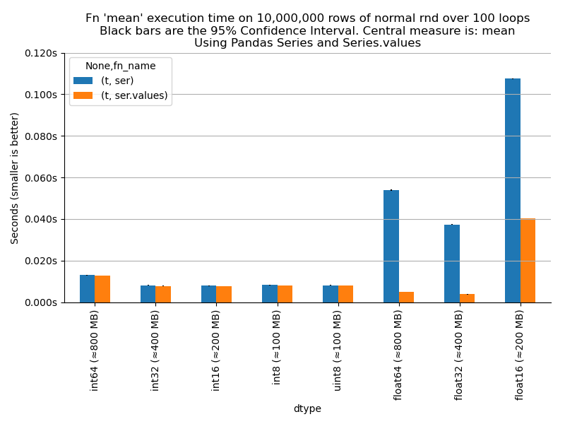

# dtype_pandas_numpy_speed_test
Speed test on Pandas or NumPy 

# Timing

Try `$ python speed_test_combined.py` and post `timings.png` as a bug with some notes on CPU if possible.



This machine: i7:
```
$ sudo i7z
i7z DEBUG: i7z version: svn-r93-(27-MAY-2013)
i7z DEBUG: Found Intel Processor
i7z DEBUG:    Stepping 3
i7z DEBUG:    Model e
i7z DEBUG:    Family 6
i7z DEBUG:    Processor Type 0
i7z DEBUG:    Extended Model 5
i7z DEBUG: msr = Model Specific Register
i7z DEBUG: Unknown processor, not exactly based on Nehalem, Sandy bridge or Ivy Bridge
i7z DEBUG: msr device files DO NOT exist, trying out a makedev script
i7z DEBUG: modprobbing for msr

```


# Setup

```
conda create -n dtype_pandas_numpy_speed_test python=3.8 pandas jupyter matplotlib watermark ipython_memory_usage memory_profiler
```
